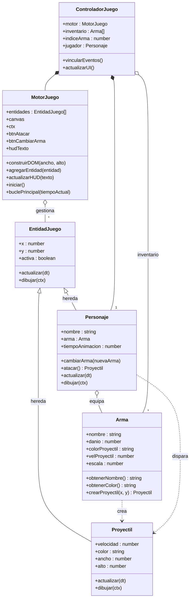

# Diagrama UML de clases

```mermaid
classDiagram
    class EntidadJuego {
        +x : number
        +y : number
        +activa : boolean
        +actualizar(dt)
        +dibujar(ctx)
    }

    class Proyectil {
        +velocidad : number
        +color : string
        +ancho : number
        +alto : number
        +actualizar(dt)
        +dibujar(ctx)
    }

    class Personaje {
        +nombre : string
        +arma : Arma
        +tiempoAnimacion : number
        +cambiarArma(nuevaArma)
        +atacar() Proyectil
        +actualizar(dt)
        +dibujar(ctx)
    }

    class Arma {
        +nombre : string
        +danio : number
        +colorProyectil : string
        +velProyectil : number
        +escala : number
        +obtenerNombre() string
        +obtenerColor() string
        +crearProyectil(x, y) Proyectil
    }

    class MotorJuego {
        +entidades : EntidadJuego[]
        +canvas
        +ctx
        +btnAtacar
        +btnCambiarArma
        +hudTexto
        +construirDOM(ancho, alto)
        +agregarEntidad(entidad)
        +actualizarHUD(texto)
        +iniciar()
        +buclePrincipal(tiempoActual)
    }

    class ControladorJuego {
        +motor : MotorJuego
        +inventario : Arma[]
        +indiceArma : number
        +jugador : Personaje
        +vincularEventos()
        +actualizarUI()
    }

    EntidadJuego <|-- Proyectil : hereda
    EntidadJuego <|-- Personaje : hereda
    Personaje o-- Arma : equipa
    Arma ..> Proyectil : crea
    Personaje ..> Proyectil : dispara
    MotorJuego o-- "*" EntidadJuego : gestiona
    ControladorJuego *-- MotorJuego
    ControladorJuego *-- "1" Personaje
    ControladorJuego o-- "*" Arma : inventario
```
